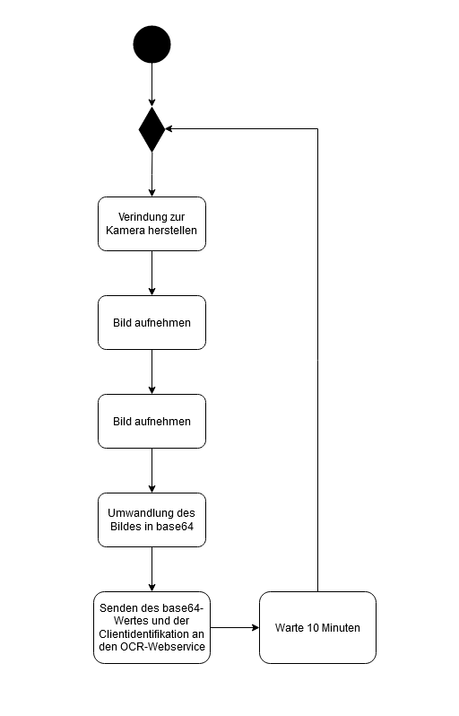

# Client: Watcher

Der Watcher läuft auf dem Raspberry PI und ist dabei verantwortlich für das Erstellen eines Bildes mit der verbundenen Kamera. In diesem Fall wird die Kamera von dem Raspberry PI mithilfe des Moduls "PiCamera" angesprochen.

Das erfasste Bild wird in einem Volume (/var/shared_client_volume/) unter dem Namen "current_cam.png" abgelegt. Durch die Docker-Konfiguration wird dieses Volume auch in dem "Client Webservice" eingebunden, sodass dieser auf die Datei zugreifen kann.

## Aktivitätsdiagramm
