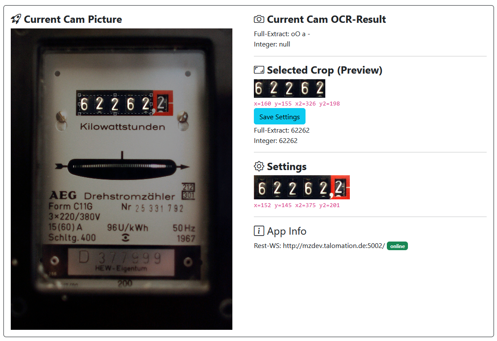

# Client: Webservice
Der Webservice läuft auf dem Raspberry PI bzw. einem Client. Er bietet ein Web-UI, mit dem Einstellungen des Clients vorgenommen werden können.

Auf der linken Seite wird das aktuellste bzw. das letzte aufgenommene Bild des Watchers angezeigt. Durch die JavaScript Bibliothek "JCrop" kann ein Ausschnitt des Bildes ausgewählt werden.

Auf der rechten Seite befinden als erstes das OCR-Ergebnis für das gesamte Bild (das aktuelle Bild->linke Seite). Darunter befindet sich der ausgewählte Ausschnitt des Bildes mit dem OCR-Ergebnis. Die Position des Ausschnitts (x,y,x2,y2) kann gespeichert werden, um diesen auf den ausgewählten Ausschnitt des Watchers anzubinden. Als letztes werden die aktuellen Einstellungen angezeigt.

Zusätzlich wird auch die URL des eingestellten Server-Webservices sowie dessen Status (Online/Offline) angezeigt.